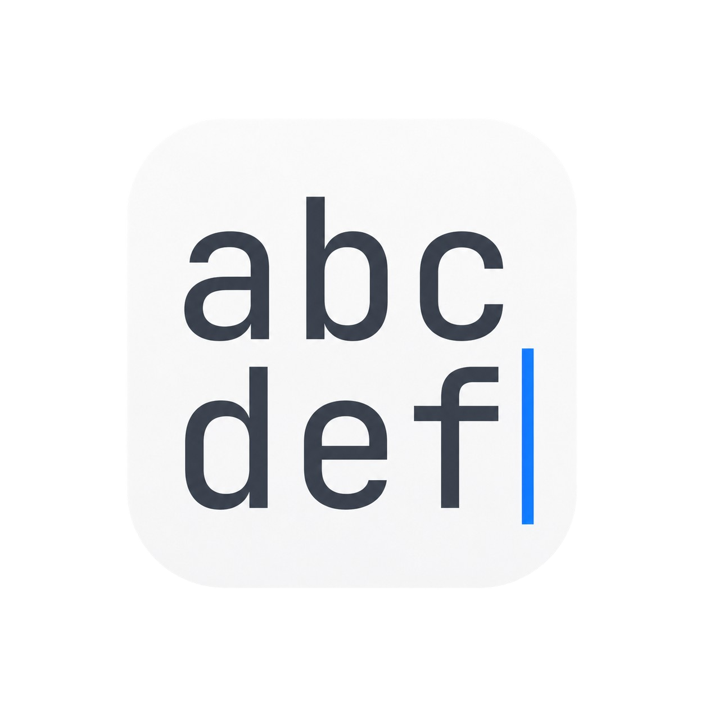
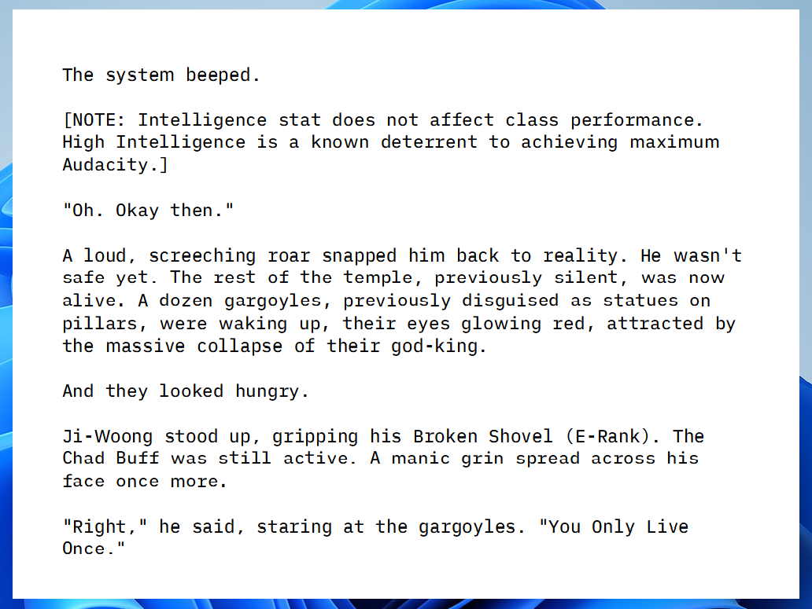
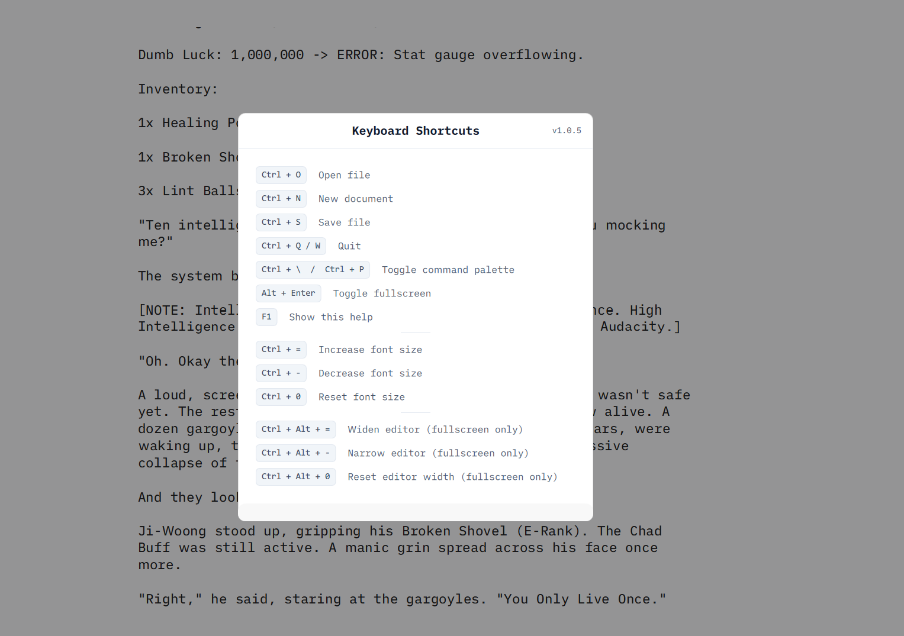

# abcdef editor

Perfection through subtraction. An ultra-minimalist, distraction-free text editor designed for raw writing, deep focus, and seamless ideas drafting.

## Philosophy

`abcdef editor` removes all the digital noise between your mind and the screen. There are no toolbars, no sidebars, and no hidden menus. It is a locked-environment editor tied to a single working directory, allowing you to instantly navigate your files via a keyboard-driven command palette. You write in a pure, sterile environment, and when your raw drafting is finished, you can easily move your text anywhere else.

---

## Our Promise

**abcdef editor will remain ultra-minimalist forever.**

We will never turn it into "yet another feature-rich editor".  
We consciously refuse to add markdown preview, plugins, cloud sync, statistics, AI features, or complex formatting.

This editor is for people who want **less**, not more.

If you came here for pure focus and raw writing — you can be sure we will never betray that love. Even in 10 or 20 years, `abcdef editor` will stay simple, clean, and distraction-free.

More advanced features will be developed in a **separate future project**.  
`abcdef editor` will always remain the pure version.

---

## Features

- **Distraction-Free UI:** Zero interface elements. Just you and your typography.
- **Single-Directory Lock:** Focus strictly on the project folder without navigating a messy file tree.
- **Command Palette (`Ctrl + P`):** Instantly search and switch between files using fuzzy matching.
- **Fullscreen with Custom Margins:** Keep your text perfectly centered for comfortable reading and writing.
- **Drag & Drop Support:** Drop any supported file right into the window to open it.
- **Dynamic Themes:** Fully customizable styling handled via a simple JSON configuration.

## Demo

Here is a quick look at the command palette navigation and smooth workflow:

<video src="https://github.com/user-attachments/assets/dcb24a1d-41e8-4ae0-baca-5b8389e9c39c" controls width="100%"></video>

<video src="https://github.com/user-attachments/assets/143b5d2a-4620-4fc9-8552-2109043ef6cb" controls width="100%"></video>

---

## Keyboard Shortcuts

The editor is built to be entirely keyboard-driven. Below is the complete list of available shortcuts:

| Shortcut | Description |
| :--- | :--- |
| **Ctrl + O** | Open file |
| **Ctrl + N** | New document |
| **Ctrl + S** | Save file |
| **Ctrl + Q** / **Ctrl + W** | Quit application |
| **Ctrl + \\** / **Ctrl + P** | Toggle command palette |
| **Alt + Enter** | Toggle fullscreen mode |
| **F1** | Show help dialog |
| | |
| **Ctrl + =** | Increase font size |
| **Ctrl + -** | Decrease font size |
| **Ctrl + 0** | Reset font size to default |
| | |
| **Ctrl + Alt + =** | Widen editor width *(fullscreen only)* |
| **Ctrl + Alt + -** | Narrow editor width *(fullscreen only)* |
| **Ctrl + Alt + 0** | Reset editor width to default *(fullscreen only)* |